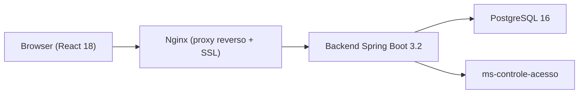
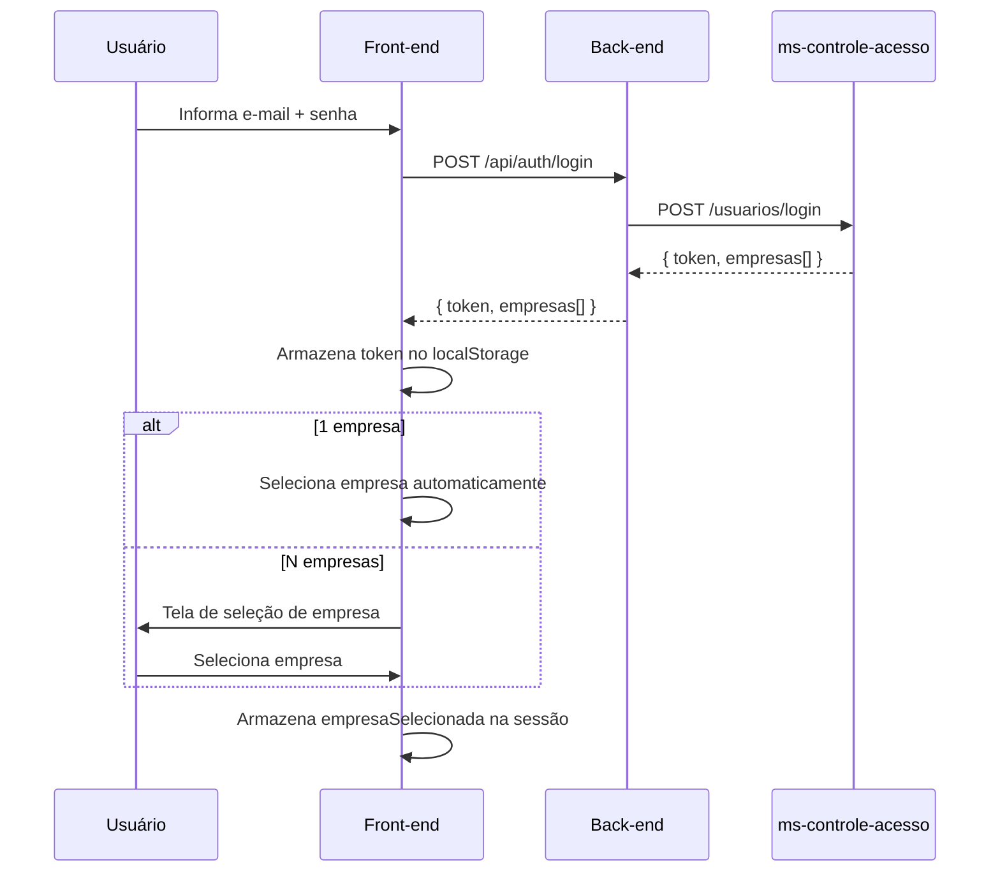
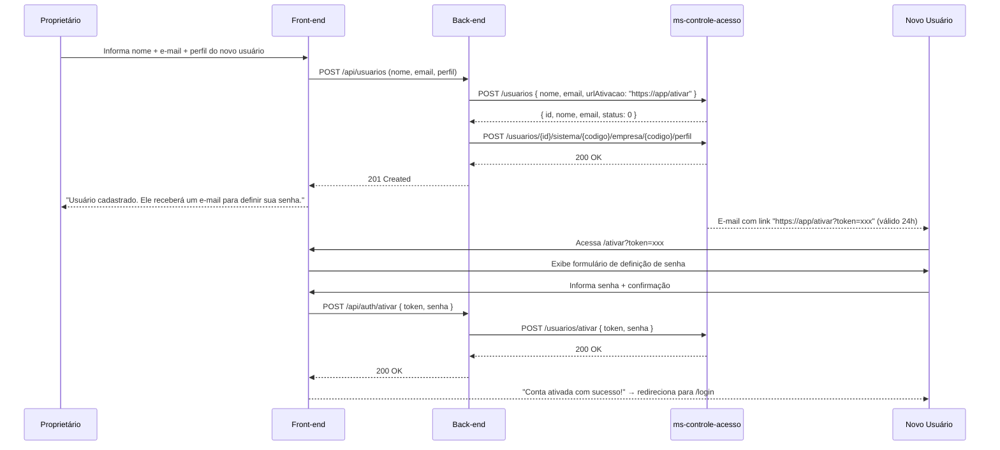
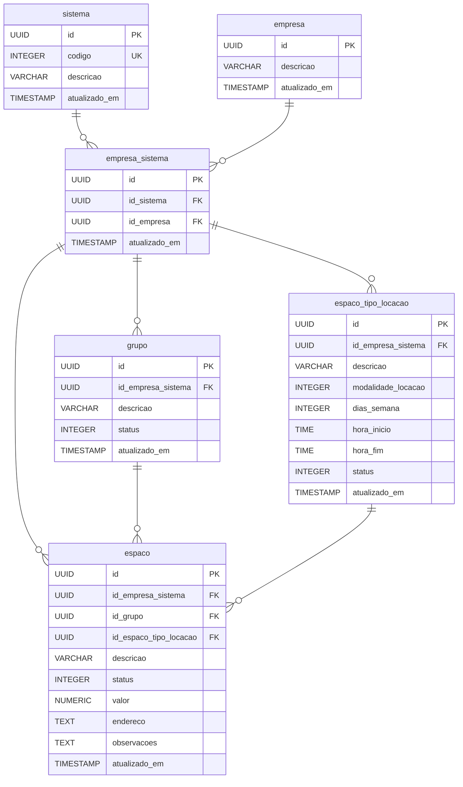

# Design Técnico — Administração de Locações de Espaço (Sprint 1)

## Visão Geral

O sistema de **Administração de Locações de Espaço** é uma aplicação web multiempresa que permite ao proprietário gerenciar espaços disponíveis para locação. A Sprint 1 cobre as funcionalidades de administração: autenticação via `ms-controle-acesso`, seleção de empresa, gestão de usuários, tipos de locação, grupos e espaços.

A arquitetura segue o padrão da plataforma: back-end Java 21 + Spring Boot 3.2.x expondo uma REST API, front-end React 18 + Vite 5 com CSS puro, banco de dados PostgreSQL 16 com Flyway, infraestrutura Docker + Nginx.



---

## Arquitetura

### Visão de Camadas

```
┌──────────────────────────────────────────┐
│  Front-end  (React 18 + Vite 5)          │
│  pages/ · api/ · utils/ · components/    │
└────────────────┬─────────────────────────┘
                 │ HTTPS (JSON REST)
┌────────────────▼─────────────────────────┐
│  Back-end  (Spring Boot 3.2, Java 21)    │
│  Controller → Service → Repository       │
│  GlobalExceptionHandler · DTOs           │
└────────┬───────────────────┬─────────────┘
         │ JDBC              │ HTTP REST
┌────────▼──────┐   ┌────────▼──────────────┐
│ PostgreSQL 16 │   │  ms-controle-acesso   │
│ (Flyway)      │   │  (auth + usuários)    │
└───────────────┘   └───────────────────────┘
```

### Princípios de Design

- **Isolamento de dados multiempresa**: todo acesso a dados é filtrado por `id_empresa_sistema`, nunca retornando registros de outra empresa.
- **Autenticação stateless**: o JWT emitido pelo `ms-controle-acesso` é armazenado no `localStorage` do navegador e enviado em cada requisição via header `Authorization: Bearer`.
- **Sem acoplamento de entidades JPA**: toda resposta da API utiliza DTOs com `@Builder` + `@Getter` + `@JsonInclude(NON_NULL)`.
- **Tratamento centralizado de erros**: `GlobalExceptionHandler` transforma todas as exceções em resposta padronizada.
- **Schema gerenciado por Flyway**: nenhuma alteração de schema via `ddl-auto`, apenas migrations versionadas.

### Fluxo de Autenticação



### Fluxo de Ativação de Conta de Novo Usuário



### Fluxo de Proteção de Rotas (Front-end)

Toda rota protegida verifica:
1. Existência e validade do JWT no `localStorage`
2. Existência de empresa selecionada na sessão
3. Perfil do usuário (Proprietário vs. Locatário)

Se alguma verificação falhar, redireciona para `/login`.

---

## Componentes e Interfaces

### Back-end — Estrutura de Pacotes

```
br.com.locacaoespacos/
├── api/
│   ├── AuthController.java
│   ├── UsuarioController.java
│   ├── GrupoController.java
│   ├── EspacoTipoLocacaoController.java
│   ├── EspacoController.java
│   ├── GlobalExceptionHandler.java
│   └── dto/
│       ├── request/
│       │   ├── LoginRequest.java
│       │   ├── GrupoRequest.java
│       │   ├── EspacoTipoLocacaoRequest.java
│       │   └── EspacoRequest.java
│       └── response/
│           ├── LoginResponse.java
│           ├── EmpresaResponse.java
│           ├── UsuarioResponse.java
│           ├── GrupoResponse.java
│           ├── EspacoTipoLocacaoResponse.java
│           └── EspacoResponse.java
├── domain/
│   ├── Sistema.java
│   ├── Empresa.java
│   ├── EmpresaSistema.java
│   ├── Grupo.java
│   ├── EspacoTipoLocacao.java
│   └── Espaco.java
├── enums/
│   ├── StatusEnum.java
│   ├── ModalidadeLocacaoEnum.java
│   └── DiaSemanaEnum.java
├── repository/
│   ├── SistemaRepository.java
│   ├── EmpresaRepository.java
│   ├── EmpresaSistemaRepository.java
│   ├── GrupoRepository.java
│   ├── EspacoTipoLocacaoRepository.java
│   └── EspacoRepository.java
├── service/
│   ├── AuthService.java
│   ├── UsuarioService.java
│   ├── GrupoService.java
│   ├── EspacoTipoLocacaoService.java
│   └── EspacoService.java
├── client/
│   └── ControleAcessoClient.java
├── exception/
│   ├── NegocioException.java
│   ├── RecursoNaoEncontradoException.java
│   └── ConflitoDependenciaException.java
├── config/
│   ├── SecurityConfig.java
│   └── WebClientConfig.java
└── LocacaoEspacosApplication.java
```

### Endpoints REST

#### Autenticação e Ativação

| Método | Endpoint | Descrição | Auth |
|--------|----------|-----------|------|
| POST | `/api/auth/login` | Autentica usuário via ms-controle-acesso | — |
| POST | `/api/auth/ativar` | Ativa conta com token recebido por e-mail | — |

**POST /api/auth/login**
```json
// Request
{ "email": "user@empresa.com", "senha": "Senha@123" }

// Response 200
{
  "token": "eyJ...",
  "nome": "João Silva",
  "empresas": [
    { "id": "uuid", "descricao": "Empresa Exemplo LTDA" }
  ]
}
```

**POST /api/auth/ativar**
```json
// Request
{ "token": "token-de-ativacao-recebido-por-email", "senha": "Senha@123" }

// Response 200 — sem body

// Response 400
{ "timestamp": "...", "status": 400, "erro": "Token de ativação inválido ou expirado." }
```

#### Usuários

| Método | Endpoint | Descrição | Auth |
|--------|----------|-----------|------|
| GET | `/api/usuarios` | Lista usuários da empresa da sessão | 🔒 Proprietário |
| POST | `/api/usuarios/verificar-email` | Verifica se e-mail existe no ms-controle-acesso | 🔒 Proprietário |
| POST | `/api/usuarios` | Cadastra e associa usuário à empresa | 🔒 Proprietário |
| POST | `/api/usuarios/{idUsuario}/perfil` | Atualiza perfil de usuário na empresa | 🔒 Proprietário |
| DELETE | `/api/usuarios/{idUsuario}` | Remove associação do usuário à empresa | 🔒 Proprietário |

#### Grupos

| Método | Endpoint | Descrição | Auth |
|--------|----------|-----------|------|
| GET | `/api/grupos` | Lista grupos da empresa (ativos e inativos) | 🔒 Proprietário |
| POST | `/api/grupos` | Cria novo grupo | 🔒 Proprietário |
| POST | `/api/grupos/{id}` | Edita grupo existente | 🔒 Proprietário |
| DELETE | `/api/grupos/{id}` | Exclui grupo (se não houver espaços) | 🔒 Proprietário |

#### Tipos de Locação

| Método | Endpoint | Descrição | Auth |
|--------|----------|-----------|------|
| GET | `/api/tipos-locacao` | Lista tipos (ativos e inativos) | 🔒 Proprietário |
| GET | `/api/tipos-locacao/ativos` | Lista tipos com status ativo (para formulário de espaço) | 🔒 Proprietário |
| POST | `/api/tipos-locacao` | Cria novo tipo | 🔒 Proprietário |
| POST | `/api/tipos-locacao/{id}` | Edita tipo existente | 🔒 Proprietário |
| DELETE | `/api/tipos-locacao/{id}` | Exclui tipo (se não houver espaços) | 🔒 Proprietário |

#### Espaços

| Método | Endpoint | Descrição | Auth |
|--------|----------|-----------|------|
| GET | `/api/espacos` | Lista espaços da empresa | 🔒 Proprietário |
| POST | `/api/espacos` | Cria novo espaço | 🔒 Proprietário |
| POST | `/api/espacos/{id}` | Edita espaço existente | 🔒 Proprietário |
| DELETE | `/api/espacos/{id}` | Exclui espaço | 🔒 Proprietário |

> **Nota sobre verbos**: O padrão da plataforma não usa `PUT`. Atualizações são feitas via `POST /{id}`.

### Front-end — Estrutura de Arquivos

```
src/
├── api/
│   ├── authApi.js
│   ├── usuarioApi.js
│   ├── grupoApi.js
│   ├── tipoLocacaoApi.js
│   └── espacoApi.js
├── components/
│   ├── Sidebar.jsx
│   ├── NavbarMobile.jsx
│   ├── ProtectedRoute.jsx
│   ├── TipoLocacaoModal.jsx
│   └── ConfirmModal.jsx
├── pages/
│   ├── Login.jsx
│   ├── AtivarConta.jsx       — rota pública /ativar?token=xxx
│   ├── SelecionarEmpresa.jsx
│   ├── Usuarios.jsx
│   ├── Grupos.jsx
│   ├── TiposLocacao.jsx
│   └── Espacos.jsx
├── utils/
│   ├── auth.js          — helpers de JWT e sessão
│   ├── bitmask.js       — conversão DiaSemanaEnum ↔ bitmask
│   └── formatters.js    — formatação de valores, datas
├── App.jsx
├── main.jsx
└── index.css
```

### Componente `Sidebar`

- Largura `260px` no desktop (≥ 1024px), colapsável para `72px`
- Drawer deslizante em mobile (< 1024px) com overlay escuro
- Itens exibidos conforme perfil do usuário na sessão
- Transição: `transform 0.3s ease`

### Componente `TipoLocacaoModal`

Modal inline no formulário de espaço para criação rápida de tipos de locação. Ao salvar:
1. Chama `POST /api/tipos-locacao`
2. Fecha o modal
3. Atualiza o select de tipos do formulário de espaço
4. Pré-seleciona o tipo recém-criado

### Proteção de Rotas (`ProtectedRoute`)

```jsx
// Verifica JWT válido + empresa selecionada + perfil autorizado
<ProtectedRoute allowedProfiles={['PROPRIETARIO']}>
  <Grupos />
</ProtectedRoute>
```

---

## Modelos de Dados

### Diagrama de Entidades



### Enums Java

```java
public enum StatusEnum {
    INATIVO(0), ATIVO(1);
    private final int valor;
}

public enum ModalidadeLocacaoEnum {
    MES(0), DIA(1), HORA(2);
    private final int valor;
}

public enum DiaSemanaEnum {
    DOM(1), SEG(2, "Seg"), TER(4), QUA(8), QUI(16), SEX(32), SAB(64);
    private final int bit;
}
```

### Conversão Bitmask (dias da semana)

```java
// Set<DiaSemanaEnum> → int
public static int toMask(Set<DiaSemanaEnum> dias) {
    return dias.stream().mapToInt(DiaSemanaEnum::getBit).reduce(0, (a, b) -> a | b);
}

// int → Set<DiaSemanaEnum>
public static Set<DiaSemanaEnum> fromMask(Integer mask) {
    if (mask == null) return Set.of();
    return Arrays.stream(DiaSemanaEnum.values())
                 .filter(d -> (mask & d.getBit()) != 0)
                 .collect(Collectors.toSet());
}
```

No front-end, utilitário equivalente em `utils/bitmask.js`:
```js
export const toBitmask = (diasSet) =>
  [...diasSet].reduce((acc, bit) => acc | bit, 0);

export const fromBitmask = (mask) =>
  mask == null ? [] : DIA_SEMANA_BITS.filter(d => (mask & d.bit) !== 0);
```

### DTOs Principais

**EspacoTipoLocacaoRequest**
```json
{
  "descricao": "Sala de reunião — dia útil",
  "modalidade": 1,
  "diasSemana": 62,
  "horaInicio": null,
  "horaFim": null,
  "status": 1
}
```

**EspacoTipoLocacaoResponse**
```json
{
  "id": "uuid",
  "descricao": "Sala de reunião — dia útil",
  "modalidade": 1,
  "modalidadeDescricao": "DIA",
  "diasSemana": 62,
  "diasSemanaDescricao": ["Seg", "Ter", "Qua", "Qui", "Sex"],
  "horaInicio": null,
  "horaFim": null,
  "status": 1,
  "statusDescricao": "ATIVO",
  "atualizadoEm": "2025-01-15T10:30:00"
}
```

**EspacoRequest**
```json
{
  "idGrupo": "uuid",
  "idEspacoTipoLocacao": "uuid",
  "descricao": "Sala 101",
  "status": 1,
  "valor": 350.00,
  "endereco": "Bloco A, Andar 1",
  "observacoes": null
}
```

**EspacoResponse**
```json
{
  "id": "uuid",
  "grupoDescricao": "Bloco A",
  "idGrupo": "uuid",
  "descricao": "Sala 101",
  "tipoLocacaoDescricao": "Sala de reunião — dia útil",
  "idEspacoTipoLocacao": "uuid",
  "status": 1,
  "statusDescricao": "ATIVO",
  "valor": 350.00,
  "endereco": "Bloco A, Andar 1",
  "observacoes": null,
  "atualizadoEm": "2025-01-15T10:30:00"
}
```

### Migrations Flyway (ordem)

| Versão | Arquivo | Conteúdo |
|--------|---------|---------|
| V1 | `V1__create_sistema.sql` | Tabela `sistema` |
| V2 | `V2__create_empresa.sql` | Tabela `empresa` |
| V3 | `V3__create_empresa_sistema.sql` | Tabela `empresa_sistema` + UNIQUE constraint |
| V4 | `V4__create_grupo.sql` | Tabela `grupo` + índice `id_empresa_sistema` |
| V5 | `V5__create_espaco_tipo_locacao.sql` | Tabela `espaco_tipo_locacao` + índice `id_empresa_sistema` |
| V6 | `V6__create_espaco.sql` | Tabela `espaco` + índices `id_empresa_sistema`, `id_grupo` |
| V7 | `V7__seed_sistema.sql` | Inserção do registro de sistema base |

### Regras de Validação por Modalidade

| Modalidade | `dias_semana` | `hora_inicio` | `hora_fim` |
|------------|:---:|:---:|:---:|
| MES (0) | `NULL` | `NULL` | `NULL` |
| DIA (1) | Obrigatório (≥1 bit) | `NULL` | `NULL` |
| HORA (2) | Obrigatório (≥1 bit) | Obrigatório | Obrigatório |

Validação realizada tanto no front-end (feedback imediato) quanto no back-end (Bean Validation + `@Service`).

---

## Propriedades de Correção

*Uma propriedade é uma característica ou comportamento que deve ser verdadeiro em todas as execuções válidas do sistema — essencialmente, uma declaração formal sobre o que o software deve fazer. As propriedades servem como ponte entre especificações legíveis por humanos e garantias de correção verificáveis por máquinas.*

### Propriedade 1: Controle de acesso por perfil

*Para qualquer* usuário autenticado cujo perfil não seja `PROPRIETARIO`, qualquer requisição aos endpoints de gestão de usuários, grupos, tipos de locação e espaços deve ser rejeitada com status HTTP 403.

**Valida: Requisitos 4.1, 5.1, 6.1, 7.1**

### Propriedade 2: Isolamento de dados multiempresa

*Para qualquer* consulta a grupos, tipos de locação ou espaços realizada com `id_empresa_sistema` X, todos os registros retornados devem pertencer exclusivamente ao `id_empresa_sistema` X — nunca retornando registros de outra empresa.

**Valida: Requisitos 2.4, 8.2**

### Propriedade 3: Conversão bitmask dias da semana — round trip

*Para qualquer* subconjunto (inclusive vazio) de `DiaSemanaEnum`, converter para bitmask inteiro e de volta para conjunto deve produzir um conjunto idêntico ao original; e, inversamente, para qualquer bitmask inteiro válido (0–127), converter para `Set<DiaSemanaEnum>` e de volta para inteiro deve produzir o mesmo valor.

**Valida: Requisito 5.5**

### Propriedade 4: Campos obrigatórios respeitam a modalidade de locação

*Para qualquer* tipo de locação persistido no sistema com modalidade `MES`, os campos `dias_semana`, `hora_inicio` e `hora_fim` devem ser nulos; para modalidade `DIA`, `dias_semana` deve ser não-nulo e com ao menos 1 bit ativo, e `hora_inicio`/`hora_fim` devem ser nulos; para modalidade `HORA`, `dias_semana`, `hora_inicio` e `hora_fim` devem ser todos não-nulos.

**Valida: Requisitos 5.3, 5.6, 5.7, 5.8**

### Propriedade 5: Rejeição de tipo de locação com campos inválidos para a modalidade

*Para qualquer* requisição de criação ou edição de tipo de locação que viole as regras de presença de campos para a sua modalidade (ex.: `HORA` sem `hora_inicio`, `DIA` sem `dias_semana`), o sistema deve rejeitar a operação retornando erro de validação, e o registro não deve ser persistido nem modificado no banco.

**Valida: Requisito 5.10**

### Propriedade 6: Proteção de exclusão com dependência vinculada

*Para qualquer* grupo ou tipo de locação que possua ao menos um espaço vinculado (contagem > 0), qualquer tentativa de exclusão deve ser rejeitada com erro de conflito, e o registro deve permanecer inalterado no banco de dados.

**Valida: Requisitos 5.11, 6.7**

### Propriedade 7: Listagem inclui todos os registros independentemente do status

*Para qualquer* conjunto de grupos ou tipos de locação salvos no banco (com qualquer mix de status ativo e inativo), os endpoints de listagem completa (`GET /api/grupos` e `GET /api/tipos-locacao`) devem retornar todos os registros, sem omitir nenhum independentemente do status.

**Valida: Requisitos 5.2, 6.2**

### Propriedade 8: Filtragem de registros ativos para o formulário de espaço

*Para qualquer* conjunto de grupos ou tipos de locação no banco com mix de status, os endpoints de seleção usados no formulário de espaço devem retornar exclusivamente registros com `status = 1 (ATIVO)`.

**Valida: Requisitos 7.5, 7.6**

### Propriedade 9: Persistência de espaço — round trip

*Para qualquer* `EspacoRequest` válido (com todos os campos obrigatórios preenchidos), criar um espaço via `POST /api/espacos` e consultá-lo via `GET /api/espacos` deve retornar um registro com os mesmos valores de `idGrupo`, `descricao`, `idEspacoTipoLocacao`, `status` e `valor` informados na criação.

**Valida: Requisitos 7.8, 7.9**

### Propriedade 10: Exclusão de espaço remove da listagem

*Para qualquer* espaço existente, executar `DELETE /api/espacos/{id}` e em seguida `GET /api/espacos` não deve retornar o espaço excluído na resposta.

**Valida: Requisito 7.10**

---

## Tratamento de Erros

### Exceções Customizadas

| Exceção | Código HTTP | Uso |
|---------|------------|-----|
| `RecursoNaoEncontradoException` | 404 | Entidade não existe ou não pertence à empresa da sessão |
| `NegocioException` | 422 | Violação de regra de negócio (ex: modalidade + campos inválidos) |
| `ConflitoDependenciaException` | 409 | Tentativa de excluir registro com dependências vinculadas |
| `AcessoNegadoException` | 403 | Usuário sem perfil adequado para a operação |

### Formato de Resposta de Erro (padrão da plataforma)

```json
{
  "timestamp": "2025-01-15T10:30:00",
  "status": 422,
  "erro": "Horário de início é obrigatório para a modalidade HORA."
}
```

### Erros de Integração com ms-controle-acesso

| Cenário | Comportamento |
|---------|--------------|
| `401` no login | Exibir "Credenciais inválidas." (sem indicar qual campo) |
| `ms-controle-acesso` fora do ar | Exibir "Serviço de autenticação temporariamente indisponível." |
| Erro ao criar usuário (400 do ms-CA) | Exibir mensagem retornada pelo ms-CA, sem persistir a associação |
| Token JWT expirado | Redirecionar para `/login`, limpar localStorage |
| Token de ativação inválido/expirado (400 do ms-CA) | Exibir "Este link é inválido ou expirou. Solicite um novo convite ao administrador." |

### Regras de Validação no Back-end

- `@NotBlank` em todos os campos `descricao`
- `@NotNull` em `modalidade` e `status` (enums Integer)
- Validação de coerência entre modalidade e campos complementares no `Service` (não via Bean Validation simples, pois é condicional)
- Validação de `id_empresa_sistema` em todo método de Service antes de qualquer operação

---

## Estratégia de Testes

### Abordagem Geral

A estratégia combina testes unitários com testes baseados em propriedades (PBT) para os módulos de lógica pura, além de testes de integração para os fluxos críticos.

### Testes Unitários (JUnit 5 + Mockito)

Cobrem:
- `AuthService`: fluxo de login, seleção automática de empresa, erro do ms-controle-acesso
- `GrupoService`: criação, edição, proteção de exclusão com dependência
- `EspacoTipoLocacaoService`: criação, validação condicional por modalidade, proteção de exclusão
- `EspacoService`: criação, filtragem de tipos/grupos ativos, persistência de todos os campos
- `GlobalExceptionHandler`: mapeamento de exceções → códigos HTTP corretos
- `DiaSemanaEnum` / `bitmask utils`: exemplos específicos (DOM→1, SEG→2, todos→127, nenhum→0)

Cada teste de `Service` utiliza `Mockito` para simular `Repository` e `ControleAcessoClient`.

### Testes Baseados em Propriedades (jqwik)

PBT se aplica a este sistema porque há lógica pura testável com variação significativa de entrada:
- Conversão bitmask (Propriedade 3): espaço de entrada = subsets de {Dom..Sab} — 128 combinações possíveis
- Validação condicional por modalidade (Propriedades 4 e 5): muitas combinações de valores parcialmente preenchidos
- Filtragem de registros por empresa/status (Propriedades 2, 7, 8): mix de registros com variados status e empresas
- Proteção de exclusão (Propriedade 6): qualquer quantidade positiva de espaços vinculados
- Round trip de persistência de espaço (Propriedades 9 e 10)

**Biblioteca escolhida:** [`jqwik`](https://jqwik.net/) — biblioteca PBT para Java/JUnit 5, madura e amplamente usada.

Cada teste de propriedade deve executar no mínimo **100 iterações**.

Tag de referência para cada teste:
```java
// Feature: locacao-espacos, Propriedade 3: round-trip bitmask dias da semana
```

#### Exemplos de testes de propriedade

**Propriedade 3 — round trip bitmask**
```java
// Feature: locacao-espacos, Propriedade 3: round-trip bitmask dias da semana
@Property(tries = 200)
void bitmaskRoundTrip(@ForAll Set<DiaSemanaEnum> dias) {
    int mask = BitmaskUtils.toMask(dias);
    Set<DiaSemanaEnum> resultado = BitmaskUtils.fromMask(mask);
    assertThat(resultado).isEqualTo(dias);
}
```

**Propriedade 4 — campos por modalidade em tipos válidos**
```java
// Feature: locacao-espacos, Propriedade 4: campos obrigatórios respeitam modalidade
@Property(tries = 200)
void tipoLocacaoValidoRespeiteModalidade(@ForAll @From("tiposLocacaoValidos") EspacoTipoLocacaoRequest req) {
    // validar que a combinação é aceita pelo service
    assertDoesNotThrow(() -> tipoLocacaoService.validar(req));
    switch (ModalidadeLocacaoEnum.fromValor(req.getModalidade())) {
        case MES  -> { assertNull(req.getDiasSemana()); assertNull(req.getHoraInicio()); assertNull(req.getHoraFim()); }
        case DIA  -> { assertNotNull(req.getDiasSemana()); assertTrue(req.getDiasSemana() > 0); assertNull(req.getHoraInicio()); }
        case HORA -> { assertNotNull(req.getDiasSemana()); assertTrue(req.getDiasSemana() > 0); assertNotNull(req.getHoraInicio()); assertNotNull(req.getHoraFim()); }
    }
}
```

**Propriedade 6 — proteção de exclusão com dependência**
```java
// Feature: locacao-espacos, Propriedade 6: proteção de exclusão com dependência vinculada
@Property(tries = 100)
void grupoComEspacosNaoPodeSerExcluido(@ForAll UUID idGrupo, @ForAll @Positive int qtdEspacos) {
    // Arrange: mock retorna qtdEspacos > 0 para o grupo
    when(espacoRepository.countByIdGrupo(idGrupo)).thenReturn((long) qtdEspacos);
    // Act + Assert
    assertThrows(ConflitoDependenciaException.class, () -> grupoService.excluir(idGrupo, empresaSistemaId));
}
```

**Propriedade 8 — apenas registros ativos no formulário de espaço**
```java
// Feature: locacao-espacos, Propriedade 8: filtragem de registros ativos para formulário de espaço
@Property(tries = 100)
void apenasGruposAtivosNoFormularioDeEspaco(@ForAll List<Grupo> grupos) {
    // Arrange: salvar mix de grupos ativos e inativos
    when(grupoRepository.findByIdEmpresaSistemaAndStatus(any(), eq(StatusEnum.ATIVO.getValor()))).thenReturn(
        grupos.stream().filter(g -> g.getStatus() == 1).toList()
    );
    // Act
    List<GrupoResponse> ativos = grupoService.listarAtivos(empresaSistemaId);
    // Assert: todos devem ser ativos
    assertThat(ativos).allMatch(g -> g.getStatus() == 1);
}
```

### Testes de Integração

- Fluxo completo de login + seleção de empresa (com mock do ms-controle-acesso via WireMock)
- Fluxo completo de ativação de conta: token válido → senha definida → redirecionamento para login
- Fluxo de ativação com token inválido/expirado → mensagem de erro correta
- CRUD completo de grupo (com banco H2 em memória ou Testcontainers PostgreSQL)
- CRUD completo de tipo de locação (incluindo validação condicional por modalidade)
- CRUD completo de espaço (com verificação de filtragem de tipos/grupos ativos)
- Verificação de isolamento multiempresa (dados de empresa B não visíveis para sessão da empresa A)

### Testes de Front-end

- Testes de componente (Vitest + Testing Library):
  - `TipoLocacaoModal`: exibição/ocultação de campos por modalidade
  - `ProtectedRoute`: redirecionamento sem JWT / sem empresa / sem perfil
  - `AtivarConta`: exibição do formulário com token válido, mensagem de erro com token inválido, validação de senha ≠ confirmação
  - Formulário de espaço: pré-seleção de tipo ao fechar modal
- Testes de utilitário:
  - `bitmask.js`: round trip `toBitmask` → `fromBitmask` para todos os subsets possíveis de dias

### Smoke / Checklist de Deploy

- Verificar que Flyway aplicou todas as migrations sem erro
- Verificar que o endpoint `/api/auth/login` retorna 401 para credenciais inválidas
- Verificar que rotas protegidas retornam 403 sem token
